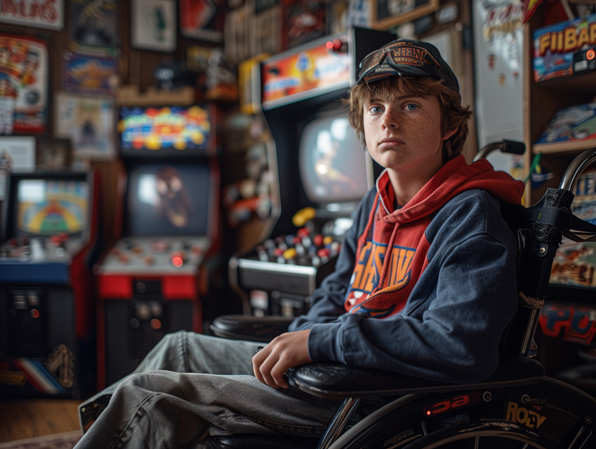

# Especificações do Projeto

## Personas

Matheus Ferreira de 25 anos estudante de ADS  sempre foi apaixonado por videogames, mas à medida que os jogos se tornavam mais complexos e exigentes em termos de hardware,Matheus se via incapaz de acompanhar as últimas tendências,desanimado, ele um dia tropeçou em um site de jogos retro. Intrigado, acessou o site e foi recebido por uma gama de jogod antigos, desde o clássicos sonic e Mario.Os controles simples e os gráficos pixelados o cativaram instantaneamente. Matheus encontrou uma plataforma que não apenas resgatou suas memórias de juventude, mas também o ajudou a superar a frustração de não conseguir jogar os títulos modernos. Ele mergulhou em aventuras retrô, redescobrindo o prazer puro de jogar, livre das complexidades dos jogos atuais.

Maria Pires de 20 anos estudante de direito sempre foi uma entusiasta dos videogames, mas à medida que o tempo passava, a vida adulta trouxe responsabilidades e pouco tempo para acompanhar as novidades tecnológicas. Sentindo-se excluída do mundo dos jogos, Maria quase desistiu de sua paixão.Um dia, seu amigo Nathan recomendou a ela uma plataforma online dedicada a jogos retro. Cética, Maria deu uma chance e ficou surpresa ao encontrar uma vasta coleção de clássicos. Desde Super Mario Bros. até Snake, ela podia reviver os jogos que moldaram sua infância.A simplicidade dos controles e a familiaridade dos personagens a fizeram esquecer as frustrações dos jogos modernos. A plataforma retro tornou-se seu refúgio nostálgico, onde ela podia escapar da vida agitada e se perder nas aventuras que a fizeram apaixonar-se por videogames em primeiro lugar.

Lucas Silva de 17 anos que esta cursando  o ensino medio, um jovem que sempre quis se perder nos mundos dos jogos, viu seus sonhos frustrados devido à sua deficiência física, que limitava seu acesso aos modernos controles complexos. Determinado a superar esse obstáculo, ele encontrou um site de jogos antigos aonde os controles eram bem simples e que não o impediam de passar horas jogando.Esse site traduzia os jogos que antes tinham comandos complexos em comandos mais simples e acessíveis. Lucas finalmente pôde jogar os jogos sem barreiras. A magia do site não apenas lhe permitiu explorar novos mundos virtuais, mas também inspirou outros jogadores com limitações físicas a seguir sua paixão

Marcio de 32 anos, um trabalhador de escritório pai de 2 filhos, sentia-se desconectado do mundo dos videogames modernos devido à falta de tempo e recursos. Um dia, ao limpar seu sótão, deparou-se com seu antigo console Sega Genesis e uma coleção empoeirada de cartuchos porem o console ja estva muito ultrapassado e não funcionava mais.Vendo a frustração de seu pai os filhos de Marcio o apresentaram um site de jogos retro de facil acesso e baixa complexibilidade,movido pela nostalgia, Marcio se interresou pelo site  dedicou seu tempo livre para redescobrir a alegria dos jogos retrô. À noite, após um longo dia de trabalho, ele mergulhava nas aventuras pixeladas de Sonic, Pacman e outros clássicos. Esses momentos proporcionaram a Marcio uma pausa bem-vinda da vida agitada e uma conexão com suas paixões passadas e uma nova forma de se divertir com seus filhos.

## Histórias de Usuários

Com base na análise das personas forma identificadas as seguintes histórias de usuários:

|EU COMO... `QUEM`   | QUERO/PRECISO ... `O QUE` |PARA ... `PORQUE`                 |
|--------------------|---------------------------|----------------------------------|
| Jogador amante de jogos classicos     | Diversas opções de jogos classicos                        | Relembrar momentos marcantes da infância, reviver a sensação e desafio proporcionada pelos jogos clássicos é algo que conecta e emociona                           |
| Jogadores casuais     | Registro rapidamente e de facil acesso                        | Para jogadores que buscam uma experiencias fáceis de aprender e jogar, tornando-os ideais para quem quer se divertir sem ter que passar horas aprendendo regras complexas.                               |
| Jogadores hardcore         | Ranking de pontuação                    | Aprimoram suas habilidades, estudando estratégias e dominando os meandros dos jogos.                               |
## Requisitos

As tabelas que se seguem apresentam os requisitos funcionais e não funcionais que detalham o escopo do projeto. Para determinar a prioridade de requisitos, aplicar uma técnica de priorização de requisitos e detalhar como a técnica foi aplicada.

### Requisitos Funcionais

|ID    | Descrição do Requisito  | Prioridade |
|------|-----------------------------------------|----|
|RF-001| Permitir que o usuario se registre no site e efetue o login e logoff. | ALTA | 
|RF-002| Acesso funcional aos Jogos  | ALTA |
|RF-003| A aplicação deve oferecer uma funcionalidade de filtro/pesquisa para permitir ao usuário localizar os jogos.   | MÉDIA |
|RF-004| Sistema de ranking (pontuaçao) para algumas aplicaçoes na soluçao.  | MÉDIA |
|RF-005| Usuário poderar alterar o nome do perfil. | MÉDIA |
|RF-006| Usuário poderar alterar a foto de perfil. | MÉDIA |
|RF-007| Usuário poderar alterar alterar o email. | MÉDIA |
|RF-008| Usuário poderar alterar a senha. | MÉDIA |
|RF-009| Usuário tera acesso ao tutorial de cada jogo na aplicação | BAIXA |
|RF-010| O sistema devera salvar a pontuaçao do usuario e exibir a maior no ranking dos 10 melhores | ALTA |
|RF-011| O usuario deve conseguir adicionar novos jogos para o publico (comunidade)  | MÉDIA |

### Requisitos não Funcionais

|ID     | Descrição do Requisito  |Prioridade |
|-------|-------------------------|----|
|RNF-001| A aplicação deve ser compatível com os navegadores. O site deve ser compatível com os principais navegadores do mercado. | ALTA | 
|RNF-002| O site deve carregar em menos de 3 segundos para 90% dos usuários.| ALTA | 
|RNF-003| O jogo deve rodar a pelo menos 30 quadros por segundo em todas as plataformas suportadas.| ALTA |
| RNF-004 |  Usabilidade e Interface Amigável: Garantir que a interface seja intuitiva e fácil de usar, atendendo a jogadores de diferentes níveis de habilidade técnica.                     | ALTA    | 
| RNF-005|  Disponibilidade e Escalabilidade: Assegurar que a plataforma esteja disponível 24 horas e seja escalável para lidar com um grande número de jogadores registrados.                      | ALTA    |
| RNF-006 |  Segurança de Dados: Armazenar os dados dos jogadores com segurança, protegendo informações pessoais e preferências de jogo contra violações.                      | ALTA    | 

## Restrições

O projeto está restrito pelos itens apresentados na tabela a seguir.

|ID| Restrição                                             |
|--|-------------------------------------------------------|
|01| A equipe não pode terceirizar o desenvolvimento da solução. |
|02| Acesso por país: O site pode ser restrito a determinados países ou regiões. |

## Diagrama de Casos de Uso

